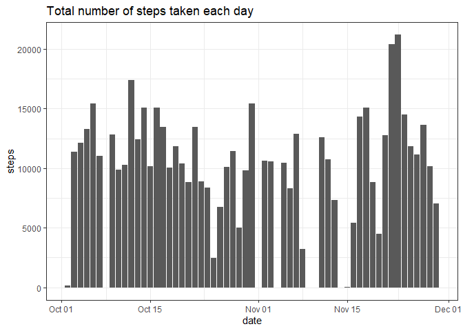
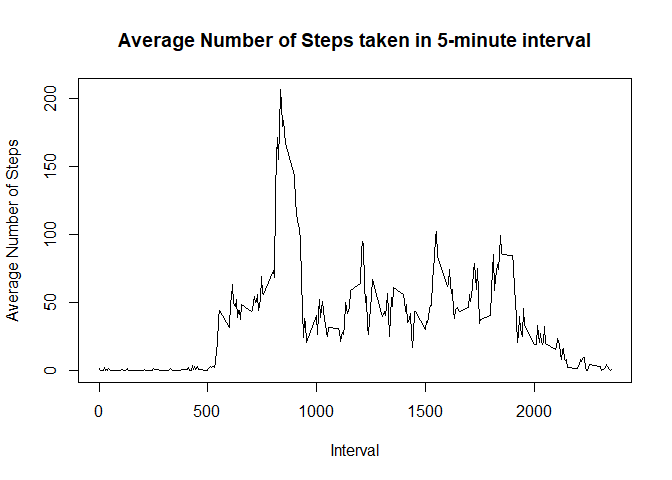
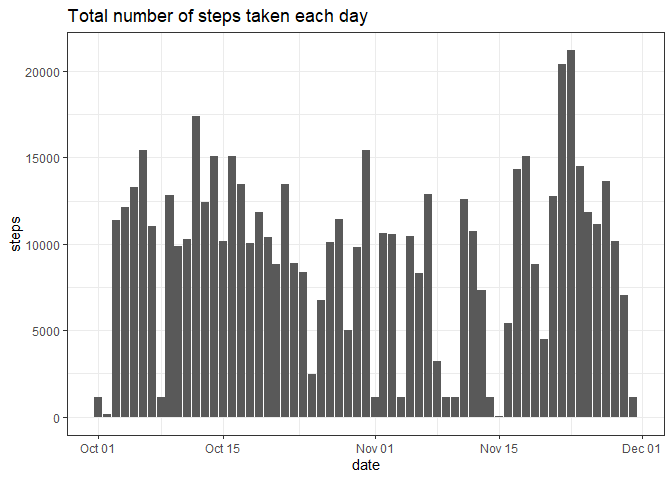
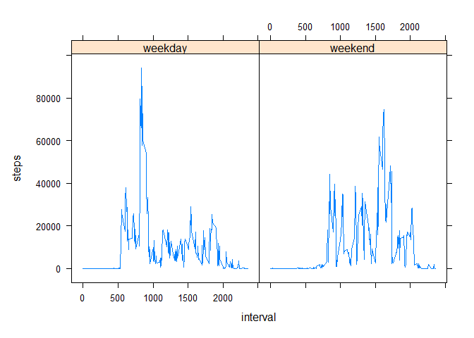

## Add libraries

```r
library(ggplot2)
```

```
## Warning: package 'ggplot2' was built under R version 4.2.3
```

```r
library(lattice)
```

## Loading and preprocessing the data

```r
data <- read.csv("activity.csv")
data$date <- as.Date(data$date, format =  "%Y-%m-%d")
data
```


## What is mean total number of steps taken per day?

```r
## get table of the sum of steps per day
sum_steps_per_day <- aggregate(data, steps~date, sum)

## calculate mean and median
mean_steps <- mean(sum_steps_per_day$steps, na.rm = T)
median_steps <- median(sum_steps_per_day$steps, na.rm = T)
mean_steps
```

```
## [1] 10766.19
```

```r
## plot histogram
ggplot(sum_steps_per_day, aes(date, steps))+
  geom_bar(stat = "identity") + theme_bw() + labs(title = "Total number of steps taken each day")
```

<!-- -->

The mean of total number of steps taken
per day is 10766.1886792453.
The median of total number of steps taken
per day is 10765


## What is the average daily activity pattern?

```r
avg_pattern <- aggregate(data, steps~interval, mean)
plot(x = avg_pattern$interval, avg_pattern$steps, type = "l",
     xlab = "Interval", ylab = "Average Number of Steps")
title(main = "Average Number of Steps taken in 5-minute interval")
```

<!-- -->

```r
max_interval <- avg_pattern[avg_pattern$steps == max(avg_pattern$steps),]$interval
```
The interval 835 on average across all the days in the dataset, contains the maximum number of steps 


## Imputing missing values

```r
sum_of_na_rows <- sum(is.na(data))
```
The providing dataset contains 2304 missing values.
# Filling the missing values

```r
# get replaced data
median_interval <- aggregate(data, steps~interval, median)

## copy original data and replace NA
filling_data <- data.frame(data)

filling_data[is.na(data),"steps"] <- sapply(data$interval,
                                            function(x) {median_interval[median_interval$interval == x, "steps"]})[is.na(data)]
```


```r
## get table of the sum of steps per day
sum_steps_per_day <- aggregate(filling_data, steps~date, sum)

## calculate mean and median
mean_steps <- mean(sum_steps_per_day$steps, na.rm = T)
median_steps <- median(sum_steps_per_day$steps, na.rm = T)
mean_steps
```

```
## [1] 9503.869
```

```r
## plot histogram
ggplot(sum_steps_per_day, aes(date, steps))+
  geom_bar(stat = "identity") + theme_bw() + labs(title = "Total number of steps taken each day")
```

<!-- -->

The mean of total number of steps taken
per day is 9503.86885245902.
The median of total number of steps taken
per day is 10395

The new values show minor discrepancies compared to the original data due to the inclusion of previously missing values on certain days. Additionally, both the mean and median have decreased as a result of filling the missing values with the median.


## Are there differences in activity patterns between weekdays and weekends?

```r
weekend_weekday <- function(x) {
  if(weekdays(x) %in% c("Saturday", "Sunday")){
    return("weekend")
  }
  return("weekday")
  }
filling_data$weekdays <- as.factor(sapply(filling_data$date, weekend_weekday))
split_data <- split(filling_data, filling_data$weekdays)

data_weekday <- aggregate(steps~ interval, split_data$weekday, var)
data_weekend <- aggregate(steps~ interval, split_data$weekend, var)
filling_data_by_weekdays <- rbind(cbind(data_weekday, weekdays = rep("weekday", nrow(data_weekday))), cbind(data_weekend, weekdays = rep("weekend", nrow(data_weekend))))
xyplot(steps ~ interval | weekdays,type = "l", data = filling_data_by_weekdays)
```

<!-- -->
